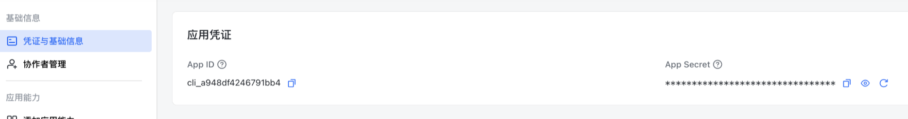
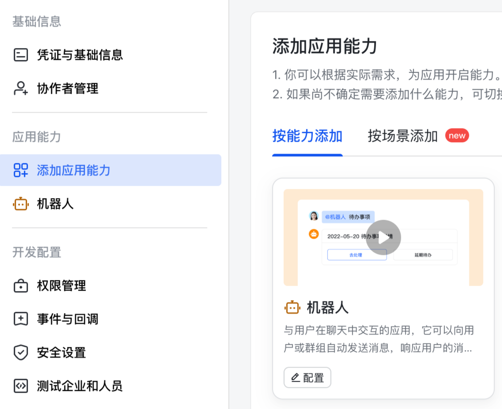
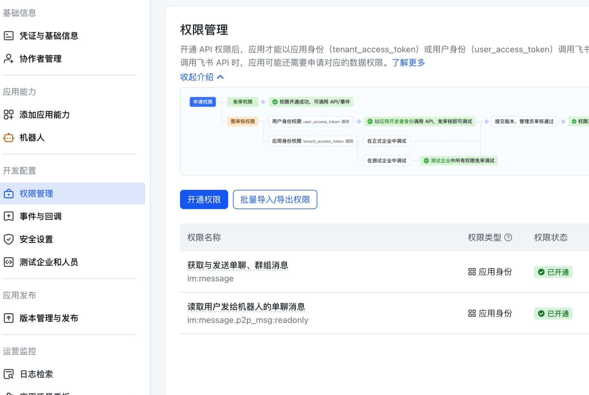
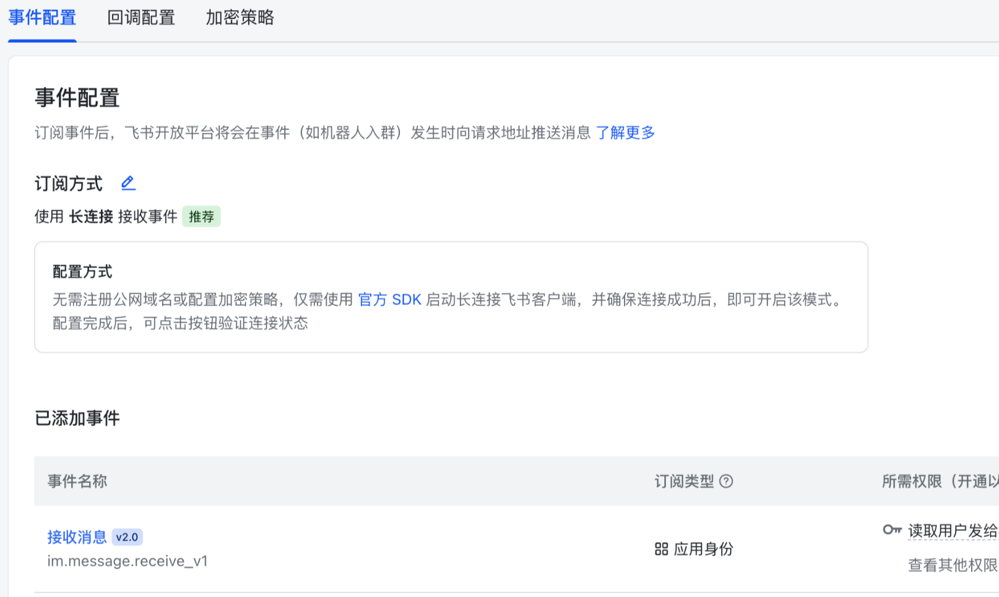
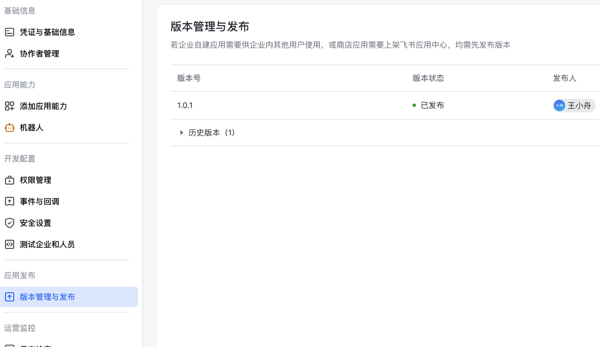

# coco

`coco` 是一个面向个人工作流的轻量级 agent 远程控制工具。

当前最核心的用法是：

- 在电脑上已经有一个正在使用的 Codex / Claude 会话
- 你出门后，想通过飞书继续和这个会话对话
- 回到电脑后，再继续使用同一个逻辑会话

这版 README 只讲 `coco` 当前最实用的 direct-session 用法，重点放在 **飞书**。

## 安装

新 clone 下来后，先装一次依赖：

```bash
cd /path/to/coco
npm install
```

## 飞书优先

### 飞书 Bot Setup

`coco` 用的是飞书**企业自建应用里的机器人**，不是群聊里的自定义 webhook 机器人。

最短路径：

1. 打开 [飞书开放平台应用管理](https://open.feishu.cn/app)，创建或进入一个企业自建应用
2. 在「凭证与基础信息」里复制 `App ID` 和 `App Secret`



3. 在「添加应用能力」里添加「机器人」



4. 在「权限管理」里开通消息权限：`im:message`、`im:message.p2p_msg:readonly`



5. 在「事件与回调」里选择「使用长连接接收事件」，添加 `im.message.receive_v1`



这里走长连接，不需要公网回调 URL。

6. 在「版本管理与发布」里发布版本



7. 把 `App ID` 和 `App Secret` 写进仓库根目录的 `.env.local`

```bash
cd /path/to/coco
cp .env.local.example .env.local
```

```dotenv
COCO_FEISHU_APP_ID=你的_app_id
COCO_FEISHU_APP_SECRET=你的_app_secret
```

8. 本地启动 bot

```bash
npm run feishu
```

**如果在服务器上启动，强烈推荐使用 tmux**

```bash
tmux new -s feishubot
npm run feishu
```

启动成功后，终端会看到：

```text
[feishu] Starting bot...
[feishu] Bot is running
```

9. 去飞书客户端搜索机器人名称，发送 `/coco current`

```text
/coco current
```

如果 bot 回复类似下面的内容，就说明飞书 setup 已经完成：

```text
Direct session state:
Active: none
No direct session bindings.
Xcheck: off
Collab: off
```

如果回复 `Not authorized.`，说明飞书链路已经通了，但 `.env.local` 里的 `COCO_FEISHU_USERS` 或 `COCO_FEISHU_CHATS` allowlist 把当前用户或聊天限制住了。

#### 高级配置

如果你想一次启动多个飞书 bot，可以在 `.env.local` 里写多组带编号的配置：

```dotenv
COCO_FEISHU_APP_ID_1=你的_app_id_1
COCO_FEISHU_APP_SECRET_1=你的_app_secret_1

COCO_FEISHU_APP_ID_2=你的_app_id_2
COCO_FEISHU_APP_SECRET_2=你的_app_secret_2
```

说明：

- 仍然使用同一个命令：`npm run feishu`
- 如果检测到带编号的多组配置，运行时会一次启动全部 bot
- 每个 bot 的聊天状态都会独立隔离，不会串 `codex` / `claude` session

## Telegram

Telegram 也能用，但这版 README 不把它当主路径。

启动方式：

```bash
cd /path/to/coco
COCO_TELEGRAM_TOKEN=你的_bot_token \
COCO_TELEGRAM_USERS=你的_numeric_user_id \
npm run telegram
```

## /coco 命令

所有 `coco` 自己的控制命令都以 `/coco` 开头。其他普通消息会发给当前绑定的 agent。

完整命令列表可以直接在飞书里发：

```text
/coco help
```

### 绑定一个已有会话

最常用的是先绑定 `lead`：

```text
/coco bind lead codex <thread_id> <cwd>
```

如果是 Claude，就是：

```text
/coco bind lead claude <session_id> <cwd>
```

这里：

- `thread_id` 是 Codex 会话 id
- `session_id` 是 Claude 会话 id
- `cwd` 是这个会话原来的项目目录

绑定成功后，直接在飞书里发普通消息即可继续这个会话。

如果想让两个 agent 协作，再绑定 `partner`：

```text
/coco bind partner codex <thread_id> <cwd>
```

### collab 模式

`collab` 会让 `lead` 和 `partner` 按 turn 数来回 relay。

在绑定了 `lead` 和 `partner` 之后：

```text
/coco collab on 3
```

之后你发一条普通消息，bot 会让两个已绑定会话来回接力 3 turn。

关闭：

```text
/coco collab off
```

也可以让中途停止：

```text
/coco collab stop
```

## 最推荐的飞书工作流

### 只继续一个已有会话

```text
/coco bind lead codex <thread_id> <cwd>
/coco current
<你要发给codex的信息>
```

如果继续 Claude 会话，把 `codex <thread_id>` 换成 `claude <session_id>`。

### 两个session之间自己协作

```text
/coco bind lead codex <thread_id> <cwd>
/coco bind partner codex <thread_id> <cwd>
/coco current
/coco collab on 20
<你要让他们互相对话的信息，这个信息默认先发给lead>
```

这时 bot 会按轮数来回输出，例如：

```text
[lead codex collab <thread_id>]
...

[partner codex collab <thread_id>]
...

[lead codex collab <thread_id>]
...
```

如果这轮还没跑完，你又发了一条普通消息，bot 会提示：

```text
collab already running, please wait
```

## 注意事项

### 1. `cwd` 必须对应原来的工作目录

这是最重要的一条。

如果你给了错误的 `cwd`：

- Claude 可能找不到 session
- Codex 即使 resume 成功，也可能在错误的 repo / 文件上下文里工作

### 2. bot 重启后要重新 bind

当前 direct-session binding 还没有做持久化。

所以：

- bot 进程重启
- Telegram / Feishu 进程重启

之后都需要重新执行 `/coco bind ...`
